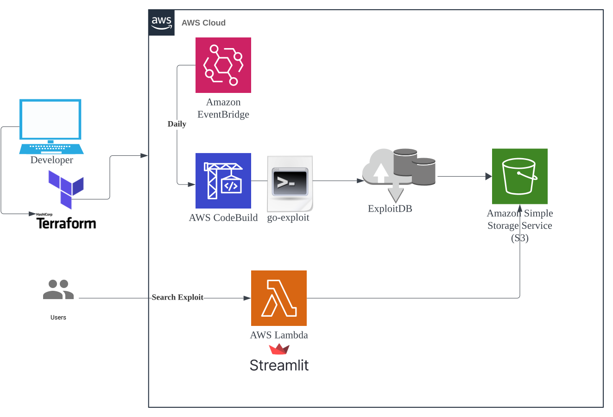

# Websploit
- searchsploit can install locally, but there are some problems like getting caught by AV.
- Use vuls module, so I can search poc on github,inthewild too!

## Check it out... https://localhost:8765



## Running For Develop
```sh
cd websploit
rye sync
rye run pytest                                                                                         
rye run streamlit run src/websploit/app.py
```
#### If you not install rye
```sh
curl -sSf https://rye-up.com/get | bash
# brew install rye
echo 'source "$HOME/.rye/env"' >> ~/.zshrc
source ~/.zshrc
```

## Deploy websploit to Cloud Run
When you push to GitHub, it automatically deploys to Cloud Run!

## Deploy AWS environment by Terraform
Ensure you have access to the target resources via AWSCLI beforehand.
```sh
terraform apply
```

## memo
- python&cloud run→streamlitがwebsocketを使うのでlambdaは使えないから
 ‐ https://zenn.dev/ncdc/articles/71d49bced3b69d#%E3%82%B3%E3%83%B3%E3%83%86%E3%83%8A%E3%81%A7%E5%8B%95%E3%81%8B%E3%81%99
  - https://chatgpt.com/share/e06aafe8-551b-42de-80dd-6cf3d49a0189
- google cloud endpointでレート制限→429エラーになれば以降は料金発生しない。
- billing alertでコンテナ停止　↑があればこれはとりあえず急ぎではない